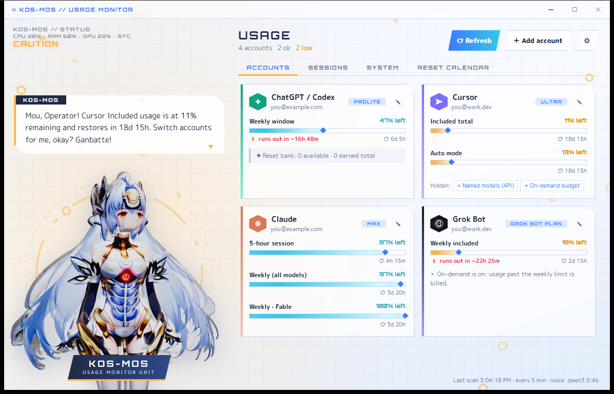
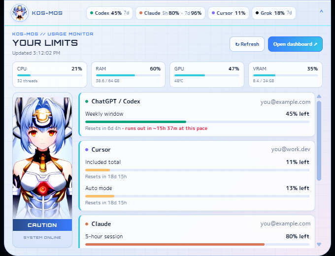
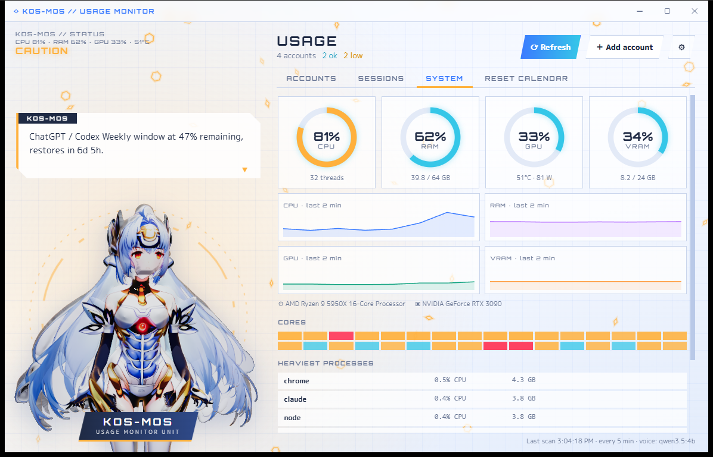
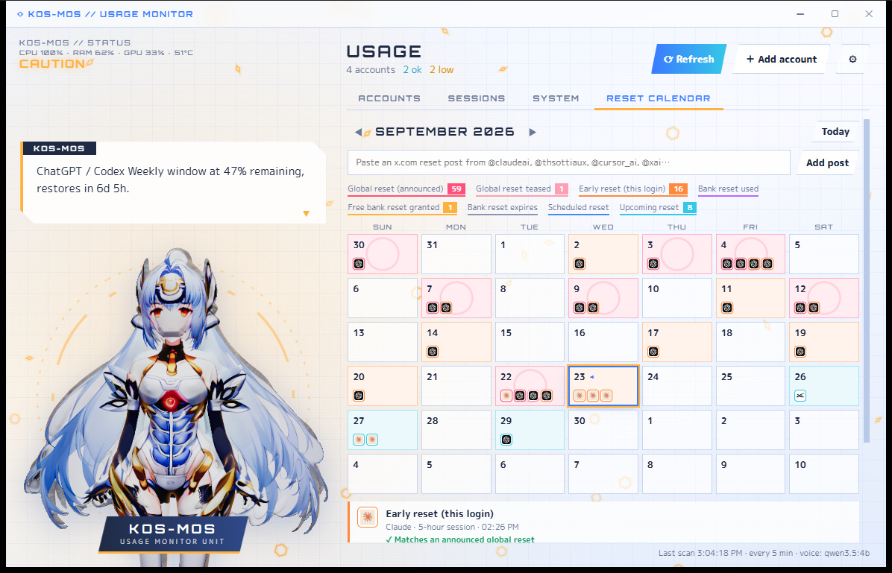
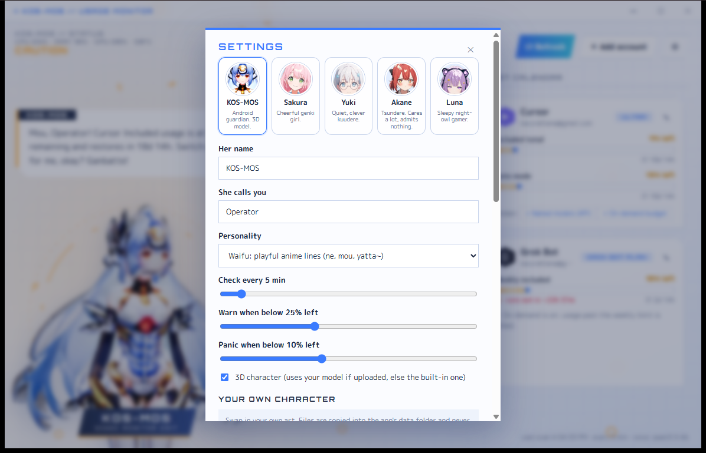

<div align="center">


# Waifu Usage Monitor

**Keep track of your Claude Code, Codex, Cursor and Grok usage limits on Windows and macOS, with an anime companion who reads them out.**

A free, open-source tray / menu-bar app and always-on-top "dynamic island" for Windows and macOS. It shows how much of your AI usage limits you have left across every account: the 5-hour and weekly windows, per-model caps, and banked resets. It warns you before you hit a rate limit.

[](#install)
[](#install)
[](https://github.com/leancoderkavy/waifu-usage-monitor/actions/workflows/build.yml)
[](https://tauri.app)
[](https://react.dev)
[](https://www.rust-lang.org)
[](LICENSE)
[](#privacy)

</div>



## Why this one?

Most usage trackers are macOS-only menu-bar apps or terminal tools. This one was built for Windows first and now runs on macOS too. It watches every major AI coding plan in one place and gives the numbers a personality.

- **One glance, every limit.** A slim island at the top of your screen shows the tightest limit for each provider. Hover it for the full breakdown.
- **Know before you hit the wall.** A burn-rate projection turns "47% left" into "at this pace you run out in 2h 10m, before the reset".
- **Several accounts, no setup.** Switch emails in Codex, Claude Code or Cursor as usual, and each login gets its own card.
- **Reset tracking.** The calendar shows global resets announced by OpenAI, Anthropic and Cursor, early resets on your own login, and banked reset credits.
- **Pick your waifu.** Five built-in companions, or upload your own art or 3D model.
- **A waifu who cares about your tokens.** *"Mou, Senpai! Cursor Included usage is at 11% remaining and restores in 18d 15h. Switch accounts for me, okay?"* Prefer calm status reports? Switch her to the Android personality.
- **Private by design.** Logins stay on your computer, encrypted with Windows DPAPI or kept in the system keychain. There is no telemetry and no server.

## Supported providers

| Provider | What you see | How it signs in |
| --- | --- | --- |
| **ChatGPT / Codex** | 5-hour and weekly plan windows, per-model limits, banked reset credits | The Codex CLI login in `~/.codex/auth.json` (auto-detected) |
| **Claude / Claude Code** | 5-hour session, weekly, per-model weekly (Pro / Max), extra usage | The Claude Code login: `~/.claude/.credentials.json` on Windows, the Keychain on macOS (auto-detected) |
| **Cursor** | Included, Auto-mode, named-model and on-demand usage for this billing cycle | The Cursor app on this computer (auto-detected), or a pasted `WorkosCursorSessionToken` cookie |
| **Grok Bot** | Weekly included usage (billed through Cursor) | Same login as Cursor |
| **OpenAI API** | This month's spend as a share of a budget you set | Admin key (`sk-admin-…`) |
| **Grok / xAI API** | Share of prepaid credits used | Management key + team id |

Every meter shows usage as a percentage, with no dollar amounts. The app reads the tools' login files but never writes to them.

## Screenshots

| Usage island (hover to expand) | System monitor |
| --- | --- |
|  |  |
| **Reset calendar** | **Settings: personality, voice, your own character** |
|  |  |

## Features

### Usage island
An always-on-top strip at the top of the screen, like a phone's dynamic island.

- **Collapsed:** each provider's tightest limit, plus a red warning pill only when CPU, RAM, GPU or VRAM runs hot.
- **Hover:** hardware gauges, every account's meters with reset countdowns, and run-out projections.

### Burn-rate projection
The app compares how much of a window you have used with how much of the window has passed. When your current pace would drain the limit before it resets, the meter shows **⚡ runs out in ~Xh** and she warns you. The first 10% of a window is too noisy, so nothing is projected then.

### Several accounts on different emails
Sign in to each email once in Codex, Claude Code or Cursor, the way you normally switch accounts. On every refresh the app:

1. Checks who is signed in to each tool.
2. Saves that login to an encrypted vault (Windows DPAPI on Windows, the Keychain on macOS).
3. Adds a card for any email it hasn't seen before.

It keeps checking earlier logins with their saved tokens and renews them when they expire. It never touches the login a tool is using right now. Hide meters you don't care about with **–**, and restore removed cards from **Add account → Removed accounts**.

### Reset calendar
- **Global resets (announced):** limits reset for everyone, or everyone got a banked reset. These come from public feeds, and you get a desktop notification.
- **Early resets (this login):** a window reset before its scheduled time, matched against announced resets.
- **Bank resets:** free reset credits granted, used or expiring (ChatGPT / Codex).
- **Scheduled and upcoming resets** for daily or longer windows.

Feeds are polled every 15 minutes, with no login: [codexresets.com](https://codexresets.com/api/resets), [inmve/token-resets](https://github.com/inmve/token-resets/releases), and any x.com reset post you paste from an official account (@claudeai, @AnthropicAI, @OpenAIDevs, @cursor_ai, @xai and others).

### Sessions and System tabs
- **Sessions:** Codex and Claude Code sessions from the last 24 hours, read from local logs, plus the models Ollama has loaded. Each row shows model, effort, project, branch and context size.
- **System:** CPU, RAM, GPU and VRAM gauges with 2-minute graphs, per-thread load and the heaviest processes. GPU stats need an NVIDIA GPU (`nvidia-smi`), so macOS shows CPU and RAM only.

## Pick your waifu


| Companion | Vibe |
| --- | --- |
| **KOS-MOS** | Android guardian with a full 3D model |
| **Sakura** | Cheerful genki girl with headphones |
| **Yuki** | Quiet, clever kuudere with glasses |
| **Akane** | Tsundere. Cares a lot, admits nothing |
| **Luna** | Sleepy night-owl gamer |

Pick one in **Settings**. Each has her own lines on top of the shared personality. Sakura, Yuki, Akane and Luna are original characters drawn with Animagine XL 4.0 by [`scripts/gen_waifus.py`](scripts/gen_waifus.py). Run it to make more.

## Make her yours

| Setting | Options |
| --- | --- |
| **Personality** | **Waifu**: playful anime lines about your tokens (*ne, mou, yatta, ganbatte~*). **Android**: calm, formal status reports. |
| **Name / what she calls you** | Any name. The default is *Senpai*. |
| **Island icon** | Upload any square image (PNG, JPG, WebP, GIF). |
| **2D character** | Upload a portrait. A transparent PNG works best. |
| **3D character** | Upload your own **GLB or VRM** model, up to 64 MB. She floats, turns toward your mouse, spins when clicked and glows in the colour of her mood. |
| **Voice** | System speech, or **your own ElevenLabs voice**: paste your API key (stored in the system keychain), load your voices and pick one. Repeated lines are cached to save credits. |
| **Local LLM lines** | Let a local model write her lines (see below). |

Uploaded files are copied into the app's data folder and never leave your computer.

### Local LLM voice (optional)
1. Install [Ollama](https://ollama.com), then run `ollama pull qwen3.5:4b` ([Qwen3.5-4B](https://huggingface.co/Qwen/Qwen3.5-4B), Apache-2.0, about 5 GB RAM).
2. Open **Settings**, turn on **Use a local LLM**, and press **Test model**.

Any OpenAI-compatible server also works, such as `llama-server` on `http://localhost:8080`. Any reply that contains a number not in your usage data is thrown out, and a template line is used instead. She never makes up numbers.

## Install

**Download:** installers for Windows (`.exe` / `.msi`) and macOS (`.dmg`, universal) will be on the [Releases](https://github.com/leancoderkavy/waifu-usage-monitor/releases) page. The macOS build is unsigned and still in beta: right-click the app and choose **Open** the first time.

**From source** (about 5 minutes on a fresh machine):

```sh
git clone https://github.com/leancoderkavy/waifu-usage-monitor.git
cd waifu-usage-monitor
npm install
npm run tauri build   # installers land in src-tauri/target/release/bundle
```

Requirements: Node 20+ and Rust stable. On Windows 10 or 11 you also need the WebView2 runtime (built into Windows 11). On macOS 11+ you also need the Xcode command-line tools. GitHub Actions builds both platforms on every push (see `.github/workflows/build.yml`).

For development: `npm run tauri dev` gives hot reload, and `npm test` plus `cargo test` (in `src-tauri`) run the tests.

## Privacy

- **No telemetry, no accounts, no backend.** The app talks only to the providers' own usage endpoints, the public reset feeds listed above, ElevenLabs (if you turn it on), and your local LLM.
- Pasted keys and your ElevenLabs key go to **Windows Credential Manager** or the **macOS Keychain**, not to disk.
- Saved logins are encrypted with **Windows DPAPI**, or kept in the **macOS Keychain**, so only your user can read them.
- Uploaded characters stay in the app's data folder (`custom/`).

## Performance

It is built to run all day without you noticing:

- Rust backend, and the dashboard and island each load only their own code.
- The 3D render loop, animations and polling pause while the dashboard is hidden in the tray.
- GPU stats are cached for 10 s, and the process list is scanned only while the System tab is open.
- The collapsed island polls hardware every 20 s.

## How it compares

| Project | Platform | Focus |
| --- | --- | --- |
| **Waifu Usage Monitor** | **Windows + macOS** tray + always-on-top island | Live plan limits for Codex, Claude, Cursor and Grok across several accounts, burn-rate projection, reset calendar, hardware monitor, companion with voice |
| [CodexBar](https://github.com/steipete/CodexBar) | macOS menu bar | Dozens of providers, reset countdowns, spend charts, widgets |
| [ccusage](https://github.com/ryoppippi/ccusage) | CLI | Token and cost reports from local Claude Code / Codex logs |
| [Claude-Code-Usage-Monitor](https://github.com/Maciek-roboblog/Claude-Code-Usage-Monitor) | Terminal UI | Claude burn rate and limit predictions |
| [ccstatusline](https://github.com/sirmalloc/ccstatusline) | Claude Code statusline | Usage and cost inside the Claude Code prompt |

These are all great tools. Pick the one that fits your OS and workflow.

## FAQ

**How do I check my Claude Code usage limit on Windows?**
Install the app and sign in to Claude Code as usual. It finds your Claude Code login and shows your 5-hour session, weekly and per-model limits.

**Does it work on macOS?**
Yes, in beta. The same app is built for macOS in CI. The island sits under the menu bar, and logins are read from the Keychain.

**Does it track the Codex / ChatGPT weekly limit?**
Yes. It shows the 5-hour and weekly windows, per-model limits and banked reset credits for every ChatGPT account you have signed in to Codex with.

**Can it track several Claude or ChatGPT accounts?**
Yes. Each email you sign in with gets its own card, and saved logins are renewed in the background.

**Does it cost anything or send my data anywhere?**
No. It is free and open source, and it has no telemetry. See [Privacy](#privacy).

**Can I use my own anime character or VTuber model?**
Yes. Upload a GLB or VRM model, a 2D portrait, or an island icon in **Settings → Your own character**.

**What isn't covered?**
grok.com / SuperGrok chat limits and ChatGPT web message caps. Neither has an API.

## Built-in characters

KOS-MOS is fan art inspired by KOS-MOS from *Xenosaga*. It was generated with open models: [Animagine XL 4.0](https://huggingface.co/cagliostrolab/animagine-xl-4.0) drew the front and back views, and [Hunyuan3D-2mv](https://huggingface.co/tencent/Hunyuan3D-2mv) built the mesh. A custom shader projects the art onto the mesh and animates the head, hair and breathing. KOS-MOS and Xenosaga belong to their respective owners, and this project is not affiliated with them. Hunyuan3D's license doesn't cover use in the EU, the UK or South Korea. Sakura, Yuki, Akane and Luna are original characters.

## Contributing

Issues and pull requests are welcome. Ideas on the roadmap:

- Cost breakdowns from local Claude Code / Codex JSONL logs
- A CLI / JSON export for terminal statuslines
- Theme presets
- Signed releases with auto-update

## License

[MIT](LICENSE). The KOS-MOS art is fan art. See [Built-in characters](#built-in-characters).

---

<sub>Keywords: Claude Code usage monitor, Codex usage limit tracker, Cursor usage tracker, AI rate limit monitor for Windows and macOS, LLM token usage widget, Claude Max weekly limit, ChatGPT Pro Codex limits, anime desktop companion, VTuber desktop pet, Tauri app.</sub>
